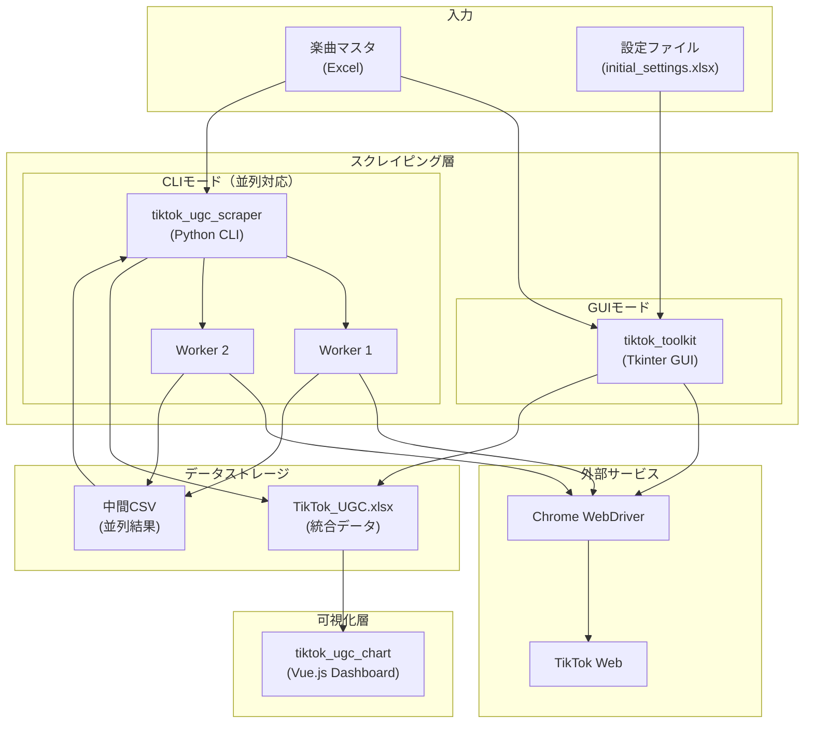
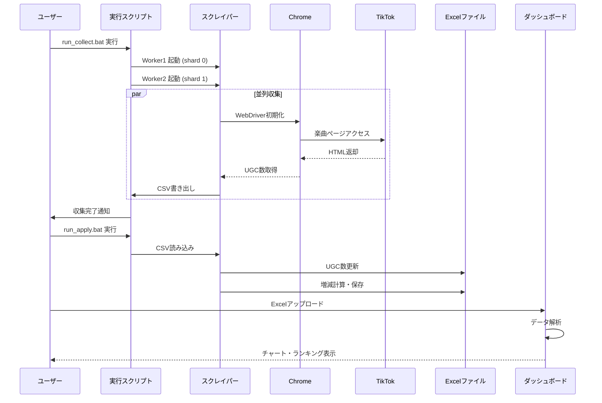
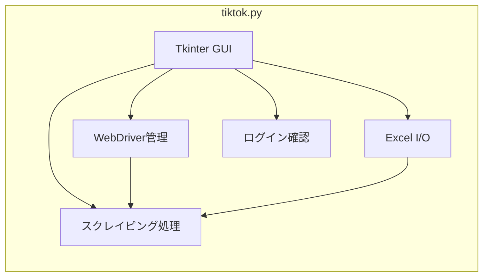
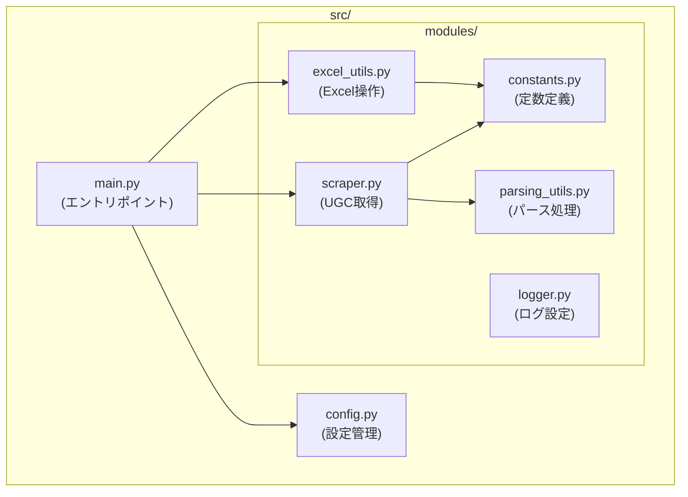
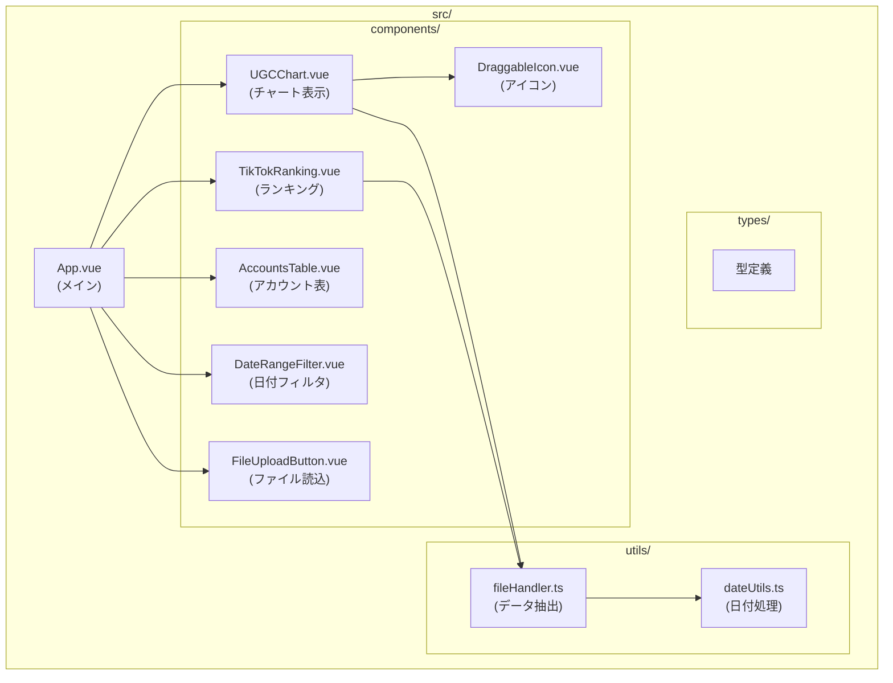
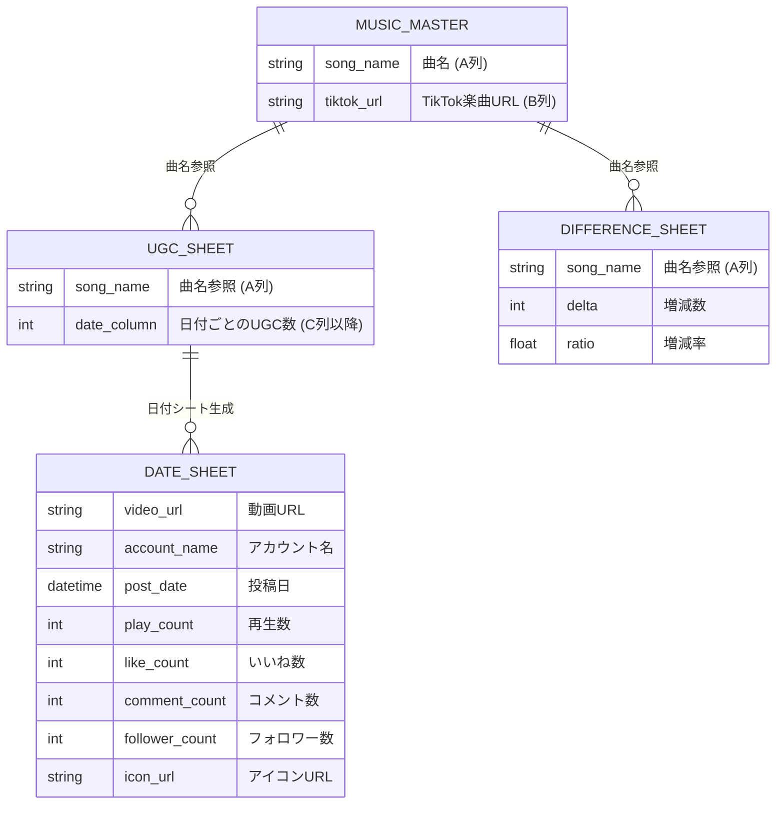
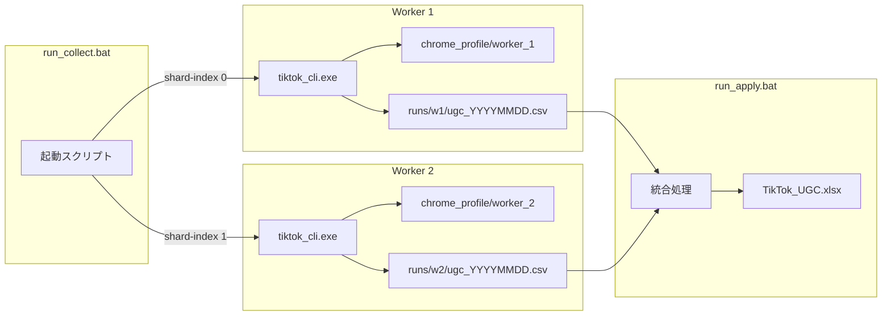
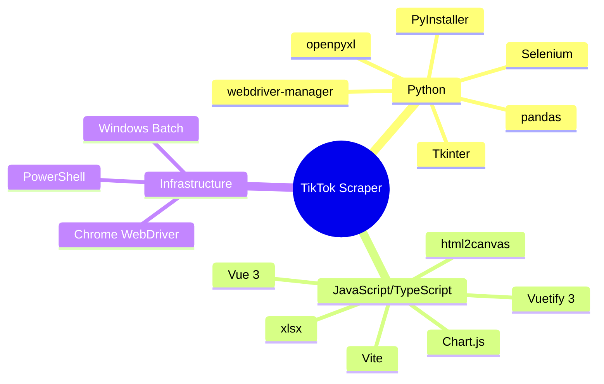

# アーキテクチャ図

## 1. システム全体アーキテクチャ

## 2. データ処理フロー

## 3. コンポーネント詳細アーキテクチャ

### 3.1 tiktok_toolkit（GUIツール）

**主要機能**:
- `function1`: 楽曲ページから動画URLリストを収集
- `function2`: 動画詳細情報（再生数、いいね数など）を取得
- `check_tiktok_login_status`: TikTokログイン状態確認

### 3.2 tiktok_ugc_scraper（CLIツール）

**動作モード**:
| モード | 説明 |
|--------|------|
| `process` | 設定ファイルに基づき全楽曲のUGC数を取得 |
| `retry` | 「取得失敗」とマークされた楽曲を再処理 |
| `collect` | シャーディングを使用した並列収集 |
| `apply` | 収集結果CSVをExcelに統合 |

### 3.3 tiktok_ugc_chart（Webダッシュボード）

## 4. Excel データ構造

## 5. 並列処理アーキテクチャ

**シャーディング処理**:
- 全楽曲リストを `shards` 数で分割
- 各ワーカーが `shard-index` に対応する楽曲のみを処理
- 例: 100曲を2ワーカーで処理 → Worker1: 0,2,4,..., Worker2: 1,3,5,...

## 6. 技術スタックまとめ

