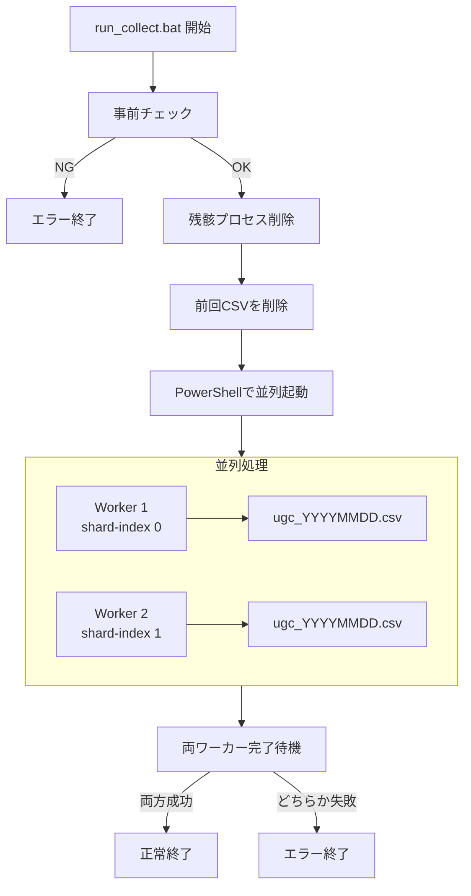
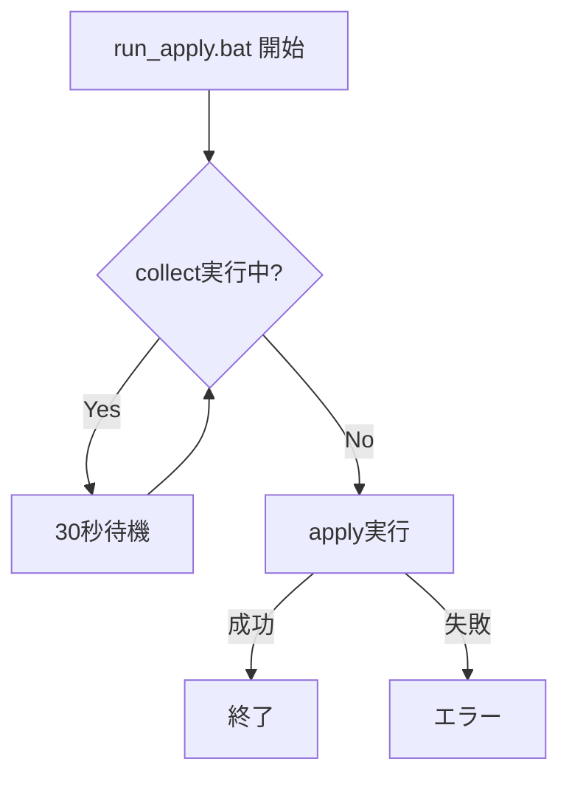

# 並列処理スクリプト詳細

## 概要

`scripts/`ディレクトリには、`tiktok_ugc_scraper`を並列実行するためのバッチスクリプトが含まれています。複数のワーカーを同時に起動し、効率的にUGCデータを収集できます。

## ファイル一覧

```
scripts/
├── run_collect.bat          # 並列収集の起動スクリプト
├── run_apply.bat            # 収集結果の統合スクリプト
├── run_detail_30_split.bat  # 詳細収集の分割スクリプト
├── stop_collect.bat         # 実行中プロセスの停止
└── sharding.cfg             # シャーディング設定
```

## run_collect.bat

### 概要

2つのワーカーを並列起動し、楽曲データを分割収集します。

### ディレクトリ構成（想定）

```
C:\Users\wduser01\Desktop\tiktokdatebase\
├── tiktok_cli.exe           # ビルド済み実行ファイル
├── logs/                    # ログ出力先
│   ├── collect_launcher_YYYYMMDD.log
│   ├── collect_w1.log
│   └── collect_w2.log
├── runs/
│   ├── w1/                  # ワーカー1出力
│   │   └── ugc_YYYYMMDD.csv
│   └── w2/                  # ワーカー2出力
│       └── ugc_YYYYMMDD.csv
├── chrome_profile/
│   ├── worker_1/            # ワーカー1プロファイル
│   └── worker_2/            # ワーカー2プロファイル
└── UGCdate/
    └── TikTok_UGC.xlsx      # マスターデータ
```

### 処理フロー



### コマンド詳細

```batch
rem === Worker 1 ===
"%EXE%" collect ^
    --settings "%SETTINGS%" ^
    --shards 2 ^
    --shard-index 0 ^
    --out "%RUN1%\ugc_%YMD%.csv" ^
    --profile-dir "%PROFILE1%" ^
    --timeout 15 ^
    --retries 3

rem === Worker 2 ===
"%EXE%" collect ^
    --settings "%SETTINGS%" ^
    --shards 2 ^
    --shard-index 1 ^
    --out "%RUN2%\ugc_%YMD%.csv" ^
    --profile-dir "%PROFILE2%" ^
    --timeout 15 ^
    --retries 3
```

### パラメータ

| パラメータ | 値 | 説明 |
|-----------|-----|------|
| `--shards` | 2 | 総ワーカー数 |
| `--shard-index` | 0 or 1 | ワーカー番号 |
| `--timeout` | 15 | ページ読込タイムアウト(秒) |
| `--retries` | 3 | リトライ回数 |

### 終了コード

| コード | 意味 |
|--------|------|
| 0 | 両ワーカー正常終了 |
| 1 | どちらかのワーカーが失敗 |
| 2 | 設定ファイルが見つからない |
| 3 | 実行ファイルが見つからない |

## run_apply.bat

### 概要

収集されたCSVファイルをマスターExcelに統合します。

### 処理フロー



### コマンド詳細

```batch
set TARGET=%ROOT%\UGCdate\TikTok_UGC.xlsx
set PATTERN=%ROOT%\runs\w*\ugc_%DATE%.csv

"%ROOT%\tiktok_cli.exe" apply ^
    --target "%TARGET%" ^
    --in "%PATTERN%"
```

### 待機ロジック

```batch
:wait_collect
tasklist /FI "IMAGENAME eq tiktok_cli.exe" | find /I "tiktok_cli.exe" >nul
if %ERRORLEVEL%==0 (
    echo [INFO] collectors still running... wait 30s
    timeout /t 30 /nobreak >nul
    goto wait_collect
)
```

collectが完了するまで30秒間隔で待機します。

## stop_collect.bat

### 概要

実行中のスクレイピングプロセスを強制終了します。

### 内容

```batch
@echo off
taskkill /f /im tiktok_cli.exe /t >nul 2>nul
taskkill /f /im chrome.exe /t >nul 2>nul
taskkill /f /im chromedriver.exe /t >nul 2>nul
echo 全プロセスを停止しました
```

## sharding.cfg

### 概要

シャーディングの設定ファイル。

```
shards=2
timeout=15
```

## 運用例

### 日次バッチ

```batch
@echo off
REM 毎朝5:00に実行

cd /d C:\Users\wduser01\Desktop\tiktokdatebase\scripts

echo [%date% %time%] 収集開始
call run_collect.bat
if errorlevel 1 (
    echo [ERROR] 収集失敗
    exit /b 1
)

echo [%date% %time%] 統合開始
call run_apply.bat
if errorlevel 1 (
    echo [ERROR] 統合失敗
    exit /b 1
)

echo [%date% %time%] 完了
```

### タスクスケジューラ設定

1. タスクスケジューラを開く
2. 「基本タスクの作成」を選択
3. トリガー: 毎日 05:00
4. アクション: プログラムの開始
   - プログラム: `cmd.exe`
   - 引数: `/c "C:\...\scripts\daily_batch.bat"`
   - 開始: `C:\...\scripts`

## トラブルシューティング

### 問題: ワーカーが起動しない

**確認事項**:
1. `tiktok_cli.exe`のパスが正しいか
2. `TikTok_UGC.xlsx`が存在するか
3. 前回のプロセスが残っていないか

**対処**:
```batch
call stop_collect.bat
call run_collect.bat
```

### 問題: CSVが生成されない

**確認事項**:
1. `logs/collect_w*.log`でエラーを確認
2. Chromeプロファイルが破損していないか

**対処**:
```batch
REM プロファイルをリセット
rmdir /s /q chrome_profile\worker_1
rmdir /s /q chrome_profile\worker_2
mkdir chrome_profile\worker_1
mkdir chrome_profile\worker_2
```

### 問題: applyが失敗する

**確認事項**:
1. CSVファイルが正しく生成されているか
2. Excelファイルが開かれていないか

**対処**:
- Excelファイルを閉じて再実行
- 手動でapplyコマンドを実行してエラーを確認

```batch
tiktok_cli.exe apply --target TikTok_UGC.xlsx --in "runs/w1/*.csv" "runs/w2/*.csv"
```

## パフォーマンス考慮

### ワーカー数の調整

- **2ワーカー**: 標準設定、CPU負荷低
- **4ワーカー**: 高速だがCPU/メモリ消費大
- **1ワーカー**: トラブル時の検証用

### タイムアウト設定

| 状況 | 推奨timeout |
|------|-------------|
| 安定した回線 | 10-15秒 |
| 不安定な回線 | 20-30秒 |
| 初回実行時 | 30秒 |

### リトライ回数

| 状況 | 推奨retries |
|------|------------|
| 通常運用 | 3回 |
| TikTok側不安定時 | 5回 |
| デバッグ時 | 1回 |
