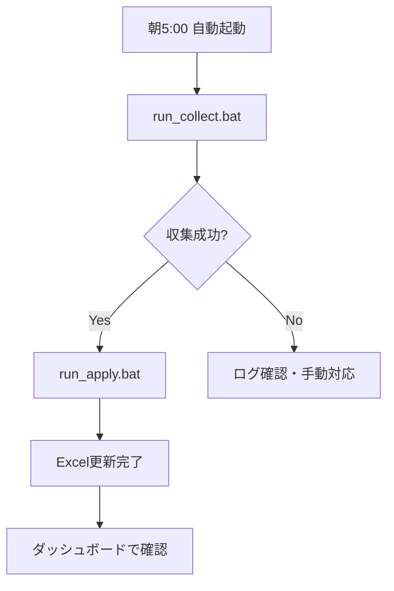

# セットアップ・運用ガイド

## 1. 環境要件

### 共通要件

| 項目 | 要件 |
|------|------|
| OS | Windows 10/11（推奨）、macOS、Linux |
| ブラウザ | Google Chrome（最新版） |
| ネットワーク | 安定したインターネット接続 |

### Python環境（tiktok_toolkit, tiktok_ugc_scraper用）

| 項目 | 要件 |
|------|------|
| Python | 3.7以上（3.10推奨） |
| pip | 最新版 |

### Node.js環境（tiktok_ugc_chart用）

| 項目 | 要件 |
|------|------|
| Node.js | 18以上 |
| npm | 9以上 |

## 2. インストール手順

### 2.1 リポジトリのクローン

```bash
git clone https://github.com/your-org/tiktok_scraper.git
cd tiktok_scraper
```

### 2.2 tiktok_toolkit のセットアップ

```bash
cd tiktok_toolkit

# 仮想環境の作成
python -m venv venv

# 仮想環境の有効化
# Windows:
venv\Scripts\activate
# macOS/Linux:
source venv/bin/activate

# 依存関係のインストール
pip install -r requirements.txt
```

### 2.3 tiktok_ugc_scraper のセットアップ

```bash
cd tiktok_ugc_scraper

# 仮想環境の作成
python -m venv .venv

# 仮想環境の有効化
# Windows:
.venv\Scripts\activate
# macOS/Linux:
source .venv/bin/activate

# 依存関係のインストール
pip install -r requirements.txt
```

### 2.4 tiktok_ugc_chart のセットアップ

```bash
cd tiktok_ugc_chart

# 依存関係のインストール
npm install
```

## 3. 初期設定

### 3.1 Excelファイルの準備

`TikTok_UGC.xlsx`を以下の構成で作成します：

#### 楽曲マスタシート

| A列（曲名） | B列（URL） |
|-------------|-----------|
| 曲名1 | https://www.tiktok.com/music/... |
| 曲名2 | https://www.tiktok.com/music/... |

#### UGCシート

- A列: 楽曲マスタへの参照（`='楽曲マスタ'!A4`など）
- B列: URL参照
- C列以降: 日付列（自動生成）

### 3.2 initial_settings.xlsx（tiktok_toolkit用）

機能1で処理する楽曲URLのリストを設定：

| A列（曲名） | B列（URL） |
|-------------|-----------|
| 曲名1 | https://www.tiktok.com/music/... |

### 3.3 プロファイルディレクトリの準備（並列実行時）

```bash
mkdir -p chrome_profile/worker_1
mkdir -p chrome_profile/worker_2
```

## 4. 実行方法

### 4.1 tiktok_toolkit（GUI）

```bash
cd tiktok_toolkit
venv\Scripts\activate
python tiktok.py
```

または：
```bash
run_tiktok.bat
```

### 4.2 tiktok_ugc_scraper（CLI）

#### 通常モード

```bash
cd tiktok_ugc_scraper
.venv\Scripts\activate

# 全楽曲のUGC数を取得
python src/main.py process --settings initial_settings.xlsx

# 失敗した楽曲を再試行
python src/main.py retry --settings TikTok_UGC.xlsx
```

#### 並列収集モード

```bash
# 収集開始
scripts/run_collect.bat

# 収集完了後、結果を統合
scripts/run_apply.bat
```

### 4.3 tiktok_ugc_chart（Web）

```bash
cd tiktok_ugc_chart

# 開発サーバー起動
npm run dev
```

ブラウザで http://localhost:5173 にアクセス

## 5. 日次運用フロー

### 推奨ワークフロー



### タスクスケジューラ設定（Windows）

1. タスクスケジューラを開く
2. 「タスクの作成」を選択
3. トリガー: 毎日 05:00
4. アクション:
   - プログラム: `cmd.exe`
   - 引数: `/c "C:\path\to\scripts\daily_batch.bat"`

### daily_batch.bat 例

```batch
@echo off
cd /d C:\path\to\tiktokdatebase\scripts

call run_collect.bat
if errorlevel 1 exit /b 1

call run_apply.bat
```

## 6. ビルド・配布

### 6.1 Python実行ファイル作成

```bash
cd tiktok_toolkit
pyinstaller --onefile tiktok.py

cd tiktok_ugc_scraper/src
pyinstaller --onefile --name tiktok_cli main.py --add-data "modules;modules"
```

### 6.2 Vue.js本番ビルド

```bash
cd tiktok_ugc_chart
npm run build
# dist/ に静的ファイルが生成される
```

## 7. トラブルシューティング

### WebDriver関連

#### Chrome起動エラー

**症状**: `WebDriverException: chrome not reachable`

**対処**:
1. Chromeを最新版に更新
2. chromedriver が自動更新されるまで待つ（webdriver-manager使用時）
3. 古いプロファイルを削除

```bash
rmdir /s /q chrome_profile
mkdir chrome_profile
```

#### タイムアウトエラー

**症状**: `TimeoutException` が多発

**対処**:
1. ネットワーク接続を確認
2. タイムアウト値を増加（config.json の `EXPLICIT_WAIT_SEC`）
3. TikTok側の一時的な障害を確認

### Excel関連

#### ファイルロックエラー

**症状**: `PermissionError: [Errno 13]`

**対処**:
- Excelで開いているファイルを閉じる
- 一時ファイル（`~$*.xlsx`）を削除

#### 読み取りエラー

**症状**: シートが見つからない

**対処**:
- シート名が正しいか確認（「楽曲マスタ」「UGC」「増減」）
- ヘッダー行が3行目にあるか確認

### 並列処理関連

#### プロセスが残留

**対処**:
```bash
scripts/stop_collect.bat
```

#### CSV出力がない

**確認**:
- `logs/collect_w1.log`でエラーを確認
- `runs/w1/`ディレクトリの存在確認

## 8. ログ管理

### ログファイル一覧

| ファイル | 場所 | 内容 |
|---------|------|------|
| tiktok.log | tiktok_toolkit/ | GUIツールのログ |
| scraper.log | tiktok_ugc_scraper/logs/ | CLIツールのログ |
| collect_w1.log | logs/ | ワーカー1のログ |
| collect_w2.log | logs/ | ワーカー2のログ |
| collect_launcher_*.log | logs/ | 起動スクリプトのログ |

### ログローテーション

`tiktok_toolkit`は自動的にログをローテーション：
- 最大サイズ: 10MB
- 保持期間: 14日

## 9. セキュリティ考慮事項

### 推奨事項

1. **API制限**: 適切な待機時間を設定し、過度なリクエストを避ける
2. **プロファイル管理**: Chromeプロファイルに保存される認証情報の保護
3. **データ保護**: 収集したデータの適切な管理

### 禁止事項

1. TikTokの利用規約に違反する使用
2. 短時間での大量リクエスト
3. 収集データの不正利用

## 10. アップデート

### 依存関係の更新

```bash
# Python
pip install --upgrade selenium openpyxl webdriver-manager

# Node.js
npm update
```

### ChromeDriver

`webdriver-manager`により自動更新されます。手動更新の必要はありません。
